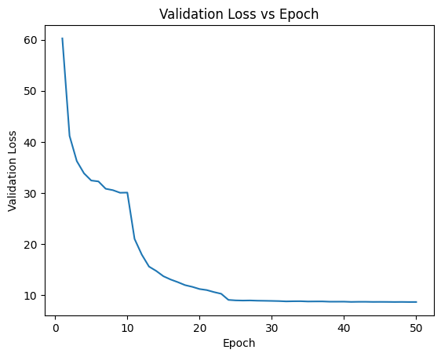

# Fine-tuning ASR Models using NVIDIA NeMo

This project explores how to fine-tune Automatic Speech Recognition (ASR) models for new languages, focusing on Italian, using NVIDIA NeMo and open-source tools.  
The goal is to adapt an English pretrained ASR model to Italian through transfer learning.

> **Note**: that the file [Finetuning_ASR.pdf](Finetuning%20ASR.pdf) were about an older version where the pretraining were done on few data and integrated with KenLM. In this latest version there is only the finetuning of the ASR. 

---

## Topics Covered

- Transfer learning for ASR systems  
- Fine-tuning QuartzNet models on a new language  
- Character set adaptation for Italian (including accented characters)

---

## Dataset

- **Source**: Mozilla Common Voice 24.0  
- **Language**: Italian  
- **Audio format**: `.mp3` (converted to `.wav`, 16 kHz, mono)  
- **Split**:
  - 70% training (~130 hours)
  - 15% validation
  - 15% test  
- **Dataset link**:  
  https://datacollective.mozillafoundation.org/datasets/cmflnuzw55y8stkav91ul91ix

---

## Model Used

- **Model**: `stt_en_quartznet15x5` (CNN-based)
- **Pretraining**: ~7000 hours of English speech
- **Adaptations**:
  - Decoder vocabulary modified to support Italian
  - Inclusion of accented characters

## Fine-Tuning Strategy

- The encoder is frozen during the first training phase (10 epochs) to reuse language-agnostic acoustic features
- The decoder is retrained on Italian transcriptions
- After the initial phase, the encoder is unfrozen and the entire network is fine-tuned
- Training is performed using `Trainer.fit()` from PyTorch Lightning
- The final model is exported in `.nemo` format

Here we can see the training loss for the epochs of training. We can clearly see in the first 10 epochs the training were done with the encoder frozen, then it has been unfrozen and all the model has been trained. 



## Results

| Model                          | Test Loss | CER     | WER     |
|--------------------------------|-----------|---------|---------|
| stt_en_quartznet15x5 (EN)      | 94.6131   | 0.4076  | 0.9783  |
| Model-IT-finetuned (EN → IT)   | **8.6633** | 0.0417  | 0.1781  |
| stt_it_quartznet15x5 (IT)      | 9.9916    | **0.0255** | **0.1040** |

These results show that the English ASR model can be effectively adapted to Italian.  
The fine-tuned model achieves a large improvement compared to the English baseline and reaches performance close to the official Italian pretrained model.

The validation loss continues to decrease throughout training, indicating that the model has not fully converged yet.  
Training was stopped due to computational cost considerations, as the main objective of cross-lingual adaptation was already achieved.

---

## Installation

Conda Setup:
```
conda create --name nemo -y python==3.10.12
conda activate nemo
pip install "nemo_toolkit[asr]"
pip install lightning
```

Then we'll download the dataset.
```
git clone https://github.com/pietroDeAngeli/ASR-Fine_tuning-NVIDIA-Nemo  

cd ASR-Fine_tuning-NVIDIA-Nemo/Fine_tuning/datasets
```

Create a new Mozilla Common Voice API Key from MCV website
```
curl -X POST "https://datacollective.mozillafoundation.org/api/datasets/cmj8u3p9q00chnxxb5fj12aw8/download" -H "Authorization: Bearer <Your API Token>" -H "Content-Type: application/json"
```
Read the answer and copy paste the download token
```
curl -X GET "https://datacollective.mozillafoundation.org/api/datasets/cmj8u3p9q00chnxxb5fj12aw8/download/<Your Download Token>" -H "Authorization: Bearer <Your API Token>" -o "Common Voice Scripted Speech 24.0 - Italian.tar.gz"
```
This will download the dataset in a compressed file.

```
tar -xzf 'Common Voice Scripted Speech 24.0 - Italian.tar.gz' 2>/dev/null

mv cv-corpus-24.0-2025-12-05/it/validated.tsv validated.tsv
mv cv-corpus-24.0-2025-12-05/it/clip_durations.tsv clip_durations.tsv
mv cv-corpus-24.0-2025-12-05/it/clips clips
rm -rf cv-corpus-24.0-2025-12-05

# Create and preprocess the dataset
python dataset_creation.py
```

At this point the dataset is ready and you can run the training file. 

